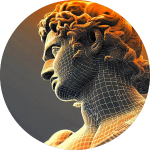

I am Bill Swearingen (hevnsnt), a super nerd about anything and everything cyber security. I started on the mean streets of the hacking scene and grew up into a career where I have run extremely large security teams for the largest of companies. This has given me a unique background to fully understand significantly advanced cyber attacks and managing corporate risk. I geek out at finding solutions which enable companies to succeed… securely.

Throughout my career, I have consistently delivered impactful results by implementing effective engineering, governance, risk management, and compliance strategies for multi-national corporations. As a vCISO for multiple organizations, I have successfully protected critical assets, ensured business continuity, and led compliance-based risk assessment and certification initiatives such as CMMC, ISO, NIST, and CIS. 

But my core strengths lie in my ability to provide decisive leadership during critical incidents. I have managed extremely high-profile engagements, including UHNW family offices, medical institutions, financial corporations, and have developed security strategies for some of the largest companies in the world.

I am an industry leader in cyber defense strategy, and have over 18 years of experience in both technical and executive cyber security roles. I have devoted my career to building and protecting critical infrastructure and Fortune 100 companies from advanced threats. I bring direct experience from ‘hands on keyboard’ from being on the front lines, and in-depth understanding of the challenges security teams are faced with. I've been there, I know what you are going through, and I put together Awesome Incident Response to hopefully make your security team better.  

Recognized as an influential figure in the industry, I have established a prominent public profile through my strong public speaking abilities. As a keynote presenter at prestigious events such as BlackHat and DEF CON, I have effectively communicated complex cybersecurity concepts to large audiences, showcasing my expertise and thought leadership. I have also facilitated executive round table discussions, fostering collaboration among industry leaders and driving strategic initiatives.

:rocket::rocket: <b>My super power is understanding how something works and teaching it to others.</b> :rocket::rocket:

I have been the founder of many security-related organizations such as SecKC ([seckc.org](https://seckc.org)) and the Cowtown Computer Congress and have served as President of Kansas City's FBI Infragard. I have also been lucky enough to serve as an active participant in National Defense and Financial Services ISACs, [M3AAWG](https://www.m3aawg.org/), [Women in Security](https://www.wiskc.org/), [DEF CON](https://defcon.org), [Black Hat](https://www.blackhat.com), and various private threat sharing organizations.

I am a big believer in **“be nice"** :slightly_smiling_face: even when things get tough and **"the harder you work, the luckier you get."** If you really want to get on my good side, show me something you made. :)

### Strong expertise in the following areas:

Incident Response, Computer Forensics, Security policy development & enforcement, Security product development, Cryptography, Blockchain, virtual currency, Legal and regulatory compliance, Information security risk assessment, Cloud Security, Modern Authentication, Vulnerability assessment, Team building and management, Malware analysis, DDoS mitigation, Large Language Models (LLM), AI, and long lists of things in camelCase.

## Work
I am a co-Founder of [TRIFIDENT Advisory Service](https://trifident.com) 

TRIFIDENT is a cybersecurity company founded by a team of experts who have extensive experience in the private sector and the U.S.  Government. My partners and a I wanted to create a company that provides the level of expertise generally only available to large companies to companies of all sizes to protect themselves from cyber threats. We understand the importance of compliance with industry regulations and standards we work with our clients to ensure that they meet the necessary requirements. We offer consulting services to help our clients design and implement effective cybersecurity strategies that align with their business objectives. We are committed to providing our clients with the tools, knowledge, and expertise they need to protect their valuable assets. We stay at the forefront of the latest trends and technologies in the cybersecurity industry to ensure that our clients have access to the most advanced cybersecurity solutions available.

Additionally, We provide the best table top exercises available. Our exercises go way beyond the traditional "Ransomeware Exercise".  We take the time to understand your company, and develop an exercise that implements real evidence for your team to find, and so many twists and turns that participants get the feel of a real event.  Our expertise allows us to develop a secenario that tests both the technical and executive teams, equipping organizations to effectively prepare for real-world cyber incident scenarios and identify critical gaps in organizational, technological, and communication processes.

## A Technical Look into Bill
Well, I would not consider myself a developer, but I like to write code.  Most of my favorite projects are currently private (sorry) but I have written tools such as:
* David: An AI LLM designed to identify vulnerabilities in code
* LocalMusic: [LocalMusic.info](http://localmusic.info) is a website that displays Local Music events in Kansas City
* IPChanger which uses the TOR Controlport to request a new exit node, and will keep working until it gets one. Essentially, this changes your external IP address each time IPChanger is run.

My goto language is always python, but here is a look into what I really write:

And finally, here is some motivation for me to start contributing code more often :)

